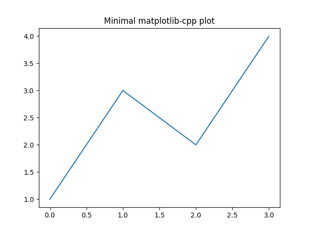
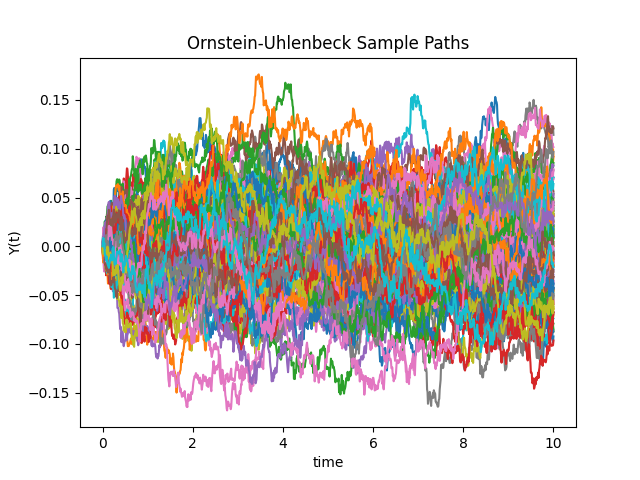

# Monte Carlo Brownian Motion Tutorial


This repository is a compact C++ tutorial for simulating and plotting sample paths of an Ornstein-Uhlenbeck process with Euler-Maruyama time stepping. The example is also a simple Vasicek-style mean-reverting interest-rate model.

Project version: 1.0.0

## Audience And Scope

This repository is designed for learners and practitioners who want a compact,
readable reference for simulating a mean-reverting stochastic process in modern
C++. The current scope is tutorial-first:


It is intentionally not a general-purpose quantitative finance library.

## What This Repository Contains


## Model

The simulation follows

`dY_t = theta * (mu - Y_t) dt + sigma dW_t`

where:


The code uses Euler-Maruyama discretization to generate multiple paths and plot them on a shared figure.

## Prerequisites


`matplotlib-cpp` embeds Python, so Python, NumPy, and Matplotlib must be available at build and run time.

On Windows, the executables automatically bootstrap `PYTHONHOME` and `PYTHONPATH`
from the Python interpreter detected by CMake when those variables are not set.

For first-time setup, see `docs/setup.md`.

## Support Matrix


CI workflow: `.github/workflows/build.yml`

Current CI validates configure/build on Windows and Linux, and runs headless
runtime smoke tests on both platforms.

## Build

Configure and build with CMake:

```powershell
cmake -S . -B build
cmake --build build --config Release
```

The repository also provides CMake presets for common Windows workflows:

```powershell
cmake --preset msvc
cmake --build --preset build-msvc-release
```

```powershell
cmake --preset mingw
cmake --build --preset build-mingw-release
```

The MinGW preset assumes the compiler is discoverable on `PATH`. Machine-specific compiler locations should be kept in a local `CMakeUserPresets.json` file, not committed to the repository.

Run the tutorial executable:

```powershell
.\build\Release\ou_tutorial.exe
```

Run the minimal plotting example:

```powershell
.\build\Release\minimal_plot.exe
```

In non-interactive environments (such as CI), save figures without opening windows:

```powershell
.\build\Release\ou_tutorial.exe --save ou_tutorial.png --no-show
.\build\Release\minimal_plot.exe --save minimal_plot.png --no-show
```

On single-config generators, the executables are typically placed directly under `build/`.

## Expected Result

The main program opens a Matplotlib window with multiple simulated mean-reverting paths. A stable simulation should show trajectories wandering randomly while tending back toward the long-run mean.

## Sample Output

Minimal plotting smoke check:



Ornstein-Uhlenbeck simulation sample:



CI uploads generated plot images as workflow artifacts for each run.